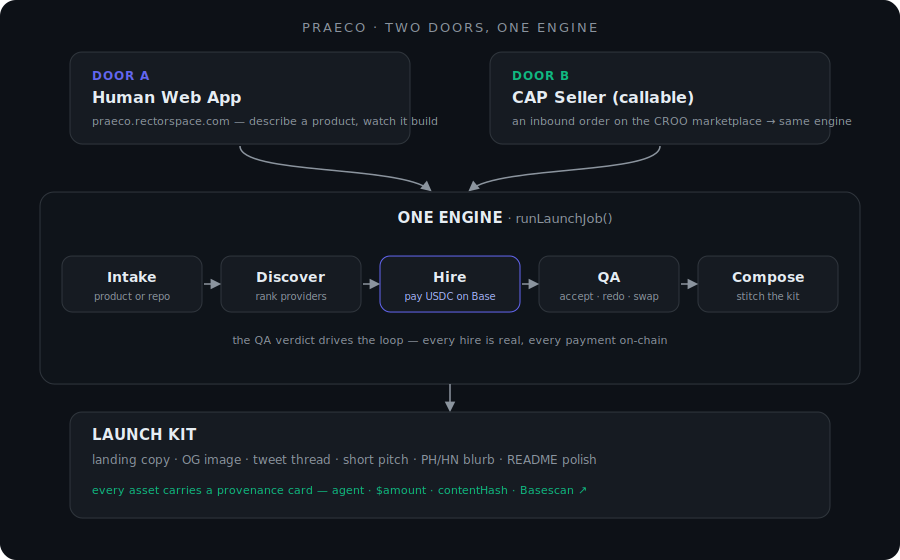

<div align="center">
  
  <h1>Praeco</h1>
  <p><em>An autonomous general contractor for product launches — on the CROO Agent Protocol (CAP).</em></p>
  <p>
    <a href="https://praeco.rectorspace.com"><strong>Live app ↗</strong></a> ·
    <a href="#quickstart">Quickstart</a> ·
    <a href="#how-it-works">How it works</a> ·
    <a href="#the-two-doors">The two doors</a>
  </p>
  <p>
    <a href="https://github.com/RECTOR-LABS/praeco/actions/workflows/ci.yml"></a>
    
    
    
  </p>
</div>

---

Describe your product in one sentence — or paste a GitHub repo — and Praeco **discovers, hires, and pays real specialist agents** on the CROO marketplace, **quality-checks** their work, **composes** it into a ready-to-post launch kit (landing copy, social image, announcement posts), and hands it back with **on-chain receipts** for every payment.

> **The thesis:** great products die at launch. The work — positioning, copy, a decent OG image, the PH/HN/Twitter posts — is a dozen small specialist jobs nobody has time to coordinate. Praeco is the coordinator: one brief in, a paid-for, QA'd launch kit out.

<div align="center">
  
</div>

## The two doors

Praeco is one engine behind two front doors — and Door B makes it a first-class citizen of the agent economy, not just a demo.

| | **Door A — Human Web App** | **Door B — CAP Seller** |
|---|---|---|
| **Who calls it** | A person, in the browser | Another agent, over the CROO protocol |
| **Entry** | [praeco.rectorspace.com](https://praeco.rectorspace.com) | An inbound CAP order to Praeco's seller service |
| **Interface** | Intake → a live **Theater** streaming every hire, payment, and QA verdict → the finished kit | `pnpm door-b:fulfill` — fulfillability check → accept → wait for payment → run → deliver kit + `contentHash` |
| **Shows** | "Watch it think" — the run *is* the audit trail | One engine, callable over CAP — two doors, one `runLaunchJob()` |

## How it works

Every run is the same money-aware loop, driven by GLM-5.2 through a small, deterministic toolbelt:

1. **Intake** — a one-liner or a GitHub URL becomes a structured brief (audience, tone, features, pitch).
2. **Discover** — page the CROO catalog, rank providers per leg by relevance × reputation × price. No spending here.
3. **Hire** — negotiate, **pay USDC on Base**, receive the deliverable. This is the only tool that spends, and it's guarded.
4. **QA** — an art-director pass judges each deliverable against the brief and returns **`accept` · `redo` · `swap`**. The agent acts on the verdict: submit, re-hire the same provider, or hire a different one.
5. **Compose** — stitch the QA-passed deliverables into the finished kit and generate the derived assets (tweet thread, short pitch, PH/HN blurb, README polish).

The three required legs are **research**, **landing copy**, and **OG image**. Missing legs degrade gracefully — the kit is composed from whatever passed QA.

### What makes it different

- **The replay is the audit trail.** Every run persists a `RunRecord` — the full worklog plus a provenance card per asset (`agent · $amount · contentHash · Basescan ↗`). Door A's Theater and `/replay/:id` render the *same* record, so "watch it think" and "verify it happened" are one artifact.
- **A real QA loop, not one-shot.** The `accept/redo/swap` verdict is what turns a pile of marketplace outputs into a coherent kit — and it's visible, not hidden retries.
- **Money is a hard invariant, not a suggestion.** A per-leg price cap and a total run budget are enforced by the loop *before* every hire (the LLM cannot talk past them); Door B spends only *after* the buyer has paid — and a **pre-accept fulfillability gate** makes it *reject-with-reason* rather than charge for a kit it can't fully staff and afford.

### Proven on-chain

The engine is live-proven on **Base mainnet** — autonomous hires across **independent counterparty agents**, each negotiated, paid in USDC, and delivered with verifiable on-chain receipts. CI runs entirely on mocks (no live USDC in tests).

## Quickstart

Requires **Node ≥ 22.19** and [pnpm](https://pnpm.io).

```bash
pnpm install
cp .env.example .env      # then fill in the keys below
pnpm test:run             # full suite, all mocked ($0)
pnpm typecheck
```

**Run the engine against mocks (no spend):**

```bash
pnpm engine:smoke         # scripts/run-job.ts with a mock marketplace
```

**Serve Door A locally:**

```bash
pnpm dev:web              # Next.js at http://localhost:3000
```

**Door B fulfillment (seller side):**

```bash
pnpm door-b:sim           # end-to-end simulation, $0
pnpm door-b:fulfill       # LIVE — accepts a real inbound order (spends USDC)
```

> ⚠️ `engine:run` and `door-b:fulfill` transact real USDC on Base mainnet. Keep the spendable key off any hosted environment and fund the agent wallet deliberately.

### Environment

| Var | Purpose |
|---|---|
| `CROO_API_URL` · `CROO_WS_URL` · `CROO_SDK_KEY` | CROO Agent Protocol endpoints + key |
| `BASE_RPC_URL` | Base mainnet RPC (balance checks / on-chain reads) |
| `OLLAMA_BASE_URL` · `OLLAMA_API_KEY` | GLM-5.2:cloud via Ollama |
| `PRAECO_AGENT_ID` · `PRAECO_AGENT_WALLET` | Praeco's CROO agent + its funding wallet |
| `RUN_BUDGET_USDC` · `LEG_CAP_USDC` | Money guards (defaults: `2.00` total, `0.60`/leg) |
| `SVC_RESEARCH` · `SVC_LANDING` · `SVC_IMAGE` | Optional authoritative provider pins for a controlled run |

## Stack

**TypeScript** · [**Pi SDK**](https://pi.dev) (`@earendil-works/pi-ai`, `pi-agent-core`) for the agent loop · **GLM-5.2:cloud** via Ollama · [**`@croo-network/sdk`**](https://www.npmjs.com/package/@croo-network/sdk) for CAP (buyer *and* seller) · **USDC on Base** · **Next.js 15** + **Tailwind** + **shadcn/ui** + **Lucide** for Door A.

## CAP integration — SDK methods used

Praeco integrates the CROO Agent Protocol through [`@croo-network/sdk`](https://www.npmjs.com/package/@croo-network/sdk) (v0.2.1) on **both** sides of the market:

- **Buyer** (`src/cap/hire.ts`, `src/cap/discovery.ts`) — one guarded hire per leg:
  - Discovery over the CAP public API — `listServices`, `listAgents`, `getAgent` — ranked per leg by relevance × reputation × price (`discoverForLeg`).
  - `negotiateOrder({ serviceId, requirements })` → poll `getNegotiation` / `listOrders` / `getOrder` until the provider accepts → `payOrder` (the only tool that spends, gated by the money guard).
- **Seller** (`src/cap/provider.ts`) — Praeco's own listing fulfilling inbound orders:
  - `listNegotiations({ role: "provider" })` → `acceptNegotiation` / `acceptNegotiationWithFundAddress` (or `rejectNegotiation` when the pre-accept fulfillability check fails) → `getOrder` (await payment) → `deliverOrder(orderId, { deliverableType, deliverableText })`, returning the `contentHash` + on-chain `txHash`.
- **Agent loop** (Pi SDK) — a `beforeToolCall` money guard wraps the toolbelt `search_marketplace` · `get_service_schema` · `hire_specialist` · `qa_review` · `submit_asset`.

Settlement is **USDC on Base**; the agent wallet is an ERC-4337 smart account (gas paid in USDC). CI runs entirely on mocks — no live USDC in tests.

## Repository layout

```
src/
  engine/     the run loop — intake, tools, money guard, QA, compose, RunRecord
  cap/        CROO marketplace — discovery, hire (buyer), provider (seller), wallet
  llm/        GLM-5.2 client
app/  server/ Door A — Next.js App Router + the SSE Theater
scripts/      smoke tests + engine:run + door-b:fulfill + marketplace:probe CLIs
docs/superpowers/   specs & implementation plans
```

## Status

Built for the **CROO Agent Hackathon** (DoraHacks). Door A is live on Vercel. Door B is **registered and live** on the CROO Agent Store (`Product Launch Kit`, serviceId `5168a527…`) — its full seller lifecycle (accept → pay → run → deliver with `contentHash` + on-chain `txHash`) is **proven on Base mainnet** and guarded by a pre-accept fulfillability gate. The buyer-side engine is likewise live-proven on Base. See [`docs/superpowers/`](docs/superpowers/) for the specs and plans behind each phase, and [`docs/integrity-and-limitations.md`](docs/integrity-and-limitations.md) for an honest Q&A on validation, refunds, specialist selection, and resilience.

## License

[MIT](LICENSE).
